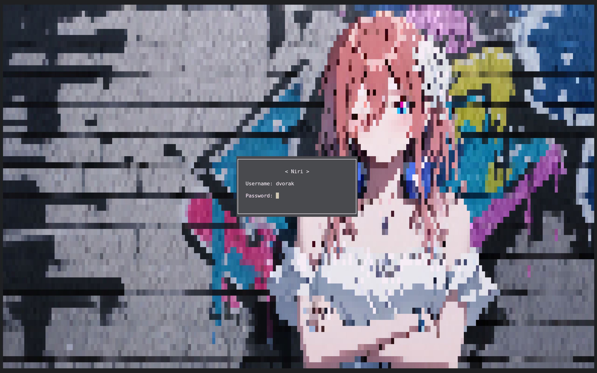

# Disgreet

A sleek, keyboard-driven TUI greeter for [greetd](https://git.sr.ht/~kennylevinsen/greetd), written in Rust. Background images welcome.





## Usage

```bash
# Show help
disgreet -h

# Launch with a background image (converted to terminal pixel art)
disgreet -b /etc/greetd/background.png
```

> **Note:** The `_greetd` user must have read permission on the image file. Placing it under `/etc/greetd/` is recommended.

### Keyboard controls

| Key   | Action                                     |
| ----- | ------------------------------------------ |
| Tab   | Cycle focus (Session → Username → Password) |
| ← / → | Switch between desktop sessions            |
| Enter | Log in                                     |
| Esc   | Exit *(debug builds only)*                 |


## Prerequisites

### Core dependency

- [greetd](https://git.sr.ht/~kennylevinsen/greetd)

### Recommended for TTY

Without these, the TTY is limited to 16 colors:

- [cage](https://github.com/cage-kiosk/cage) — minimal Wayland compositor (kiosk mode)
- [alacritty](https://github.com/alacritty/alacritty) — GPU-accelerated terminal emulator

`cage -s -- alacritty -e ./target/debug/disgreet  -b /path/to/image.png`

### Directories

Two directories must exist and be owned by the `_greetd` user:

| Path                    | Purpose                  |
| ----------------------- | ------------------------ |
| `/var/cache/disgreet/`  | Cached background images |
| `/var/log/disgreet/`    | Application logs         |

```bash
sudo mkdir -p /var/cache/disgreet /var/log/disgreet
sudo chown _greetd:_greetd /var/cache/disgreet /var/log/disgreet
```

## Installation

### Build from source

```bash
git clone https://github.com/dvorakchen/disgreet.git
cd disgreet
cargo build --release
sudo cp target/release/disgreet /usr/local/bin/
```

### Configure greetd

In `/etc/greetd/config.toml`, set disgreet as the default session:

```toml
[terminal]
vt = 1

[default_session]
command = "cage -s -- alacritty -e /usr/local/bin/disgreet -b path/to/your/image.png"
user = "_greetd"
```

## License

[Apache 2.0](LICENSE)
